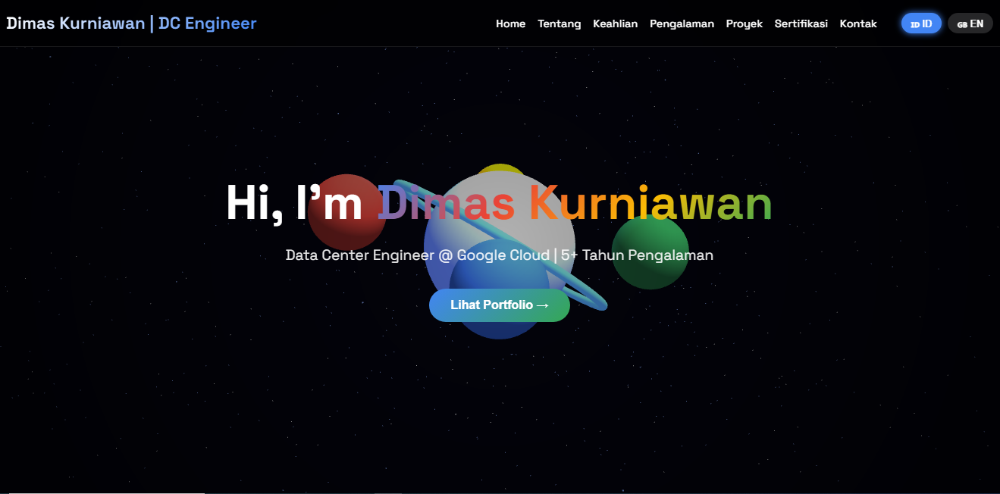
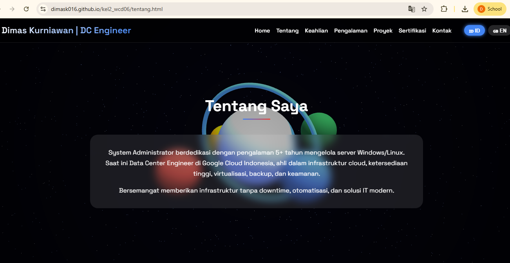
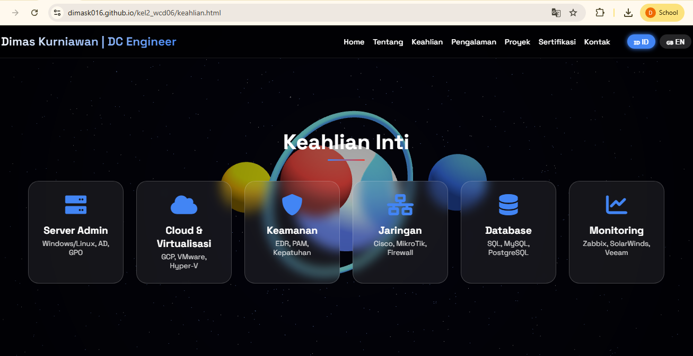
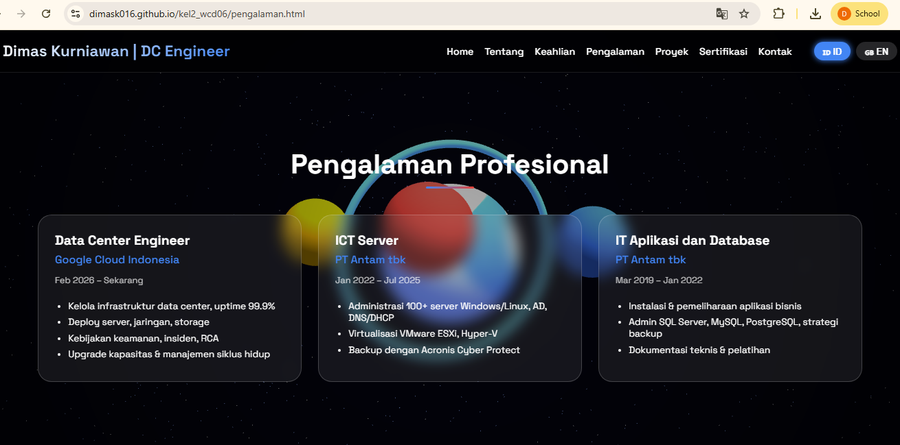
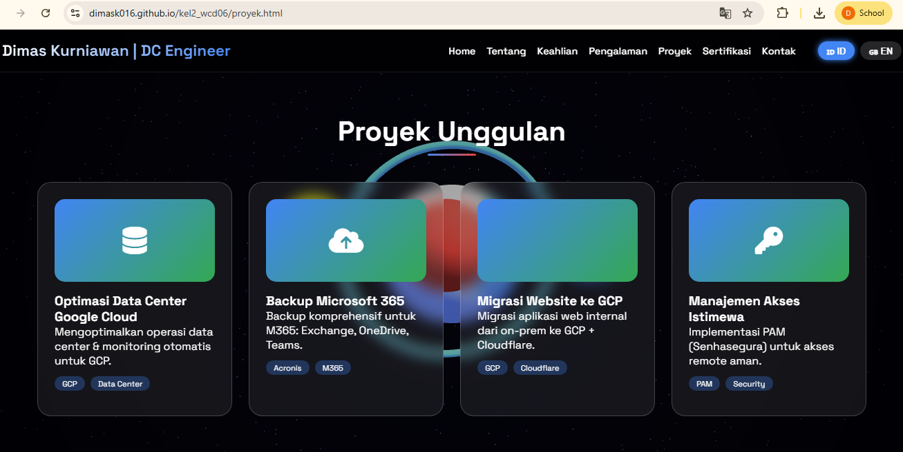
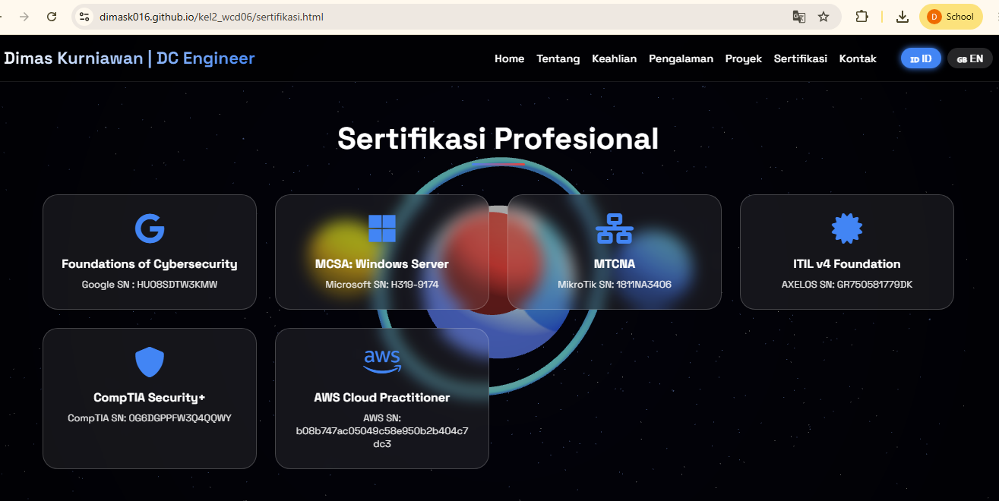
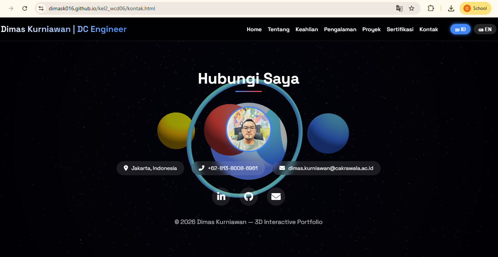

# 🚀 Web CV Portofolio Interaktif 

> Portfolio 3D Data Center Engineer dengan dukungan dua bahasa (ID/EN) dan latar belakang Three.js.

---

## 📌 1. Nama & Deskripsi Proyek

**Nama Proyek:** Web CV Portofolio Interaktif   
**Kelompok 2 – Web Class Design (WCD) 06**

**Deskripsi:**  
Sebuah website portofolio personal yang menampilkan profil, keahlian, pengalaman, proyek, sertifikasi, dan kontak dari seorang profesional di bidang teknologi informasi. Halaman ini dibangun dengan latar belakang 3D interaktif (Three.js), responsif untuk semua perangkat, dan mendukung pergantian bahasa (Indonesia/Inggris) secara dinamis.

**Anggota Tim:**
- Deva Agriani (Ketua)
- Gempur Mahya Reksa
- Fajar Muhammad Ramadhan
- Dimas Kurniawan
- Dharma Satriadi

---

## 📸 2. Tangkapan Layar (Screenshots)

> **Catatan:** Screenshot di bawah hanya contoh – silakan ganti dengan hasil tangkapan layar asli dari proyek Anda.

| Halaman | Tampilan |
|---------|----------|
| **Home** |  |
| **Tentang** |  |
| **Keahlian** |  |
| **Pengalaman** |  |
| **Proyek** |  |
| **Sertifikasi** |  |
| **Kontak** |  |

> 💡 *Jika belum memiliki folder `screenshots`, buatlah folder tersebut dan tempatkan gambar dengan nama sesuai di atas.*  
> *Anda juga bisa menggunakan layanan seperti [imgur](https://imgur.com/) dan mengganti path-nya.*

---

## 🛠️ 3. Teknologi yang Digunakan

| Teknologi | Keterangan |
|-----------|-------------|
| **HTML5** | Struktur halaman |
| **CSS3** | Styling, grid, flexbox, efek glassmorphism |
| **JavaScript (ES6)** | Logika interaktif, translasi, event handling |
| **Three.js** | Latar belakang 3D (bola mengorbit, partikel, bintang) |
| **Font Awesome** | Ikon-ikon profesional |
| **Google Fonts** | Font *Space Grotesk* modern |

---

## 💻 4. Cara Menjalankan Proyek secara Lokal

Ikuti langkah-langkah berikut untuk menjalankan website ini di komputer Anda:

### Prasyarat
- Web browser modern (Chrome, Firefox, Edge)
- (Opsional) Live Server extension jika menggunakan VS Code

### Langkah-langkah

1. **Clone repository ini**
   ```bash
   git clone https://github.com/dimask016/kel2_wcd06.git
Masuk ke folder proyek

## 🔄 Langkah-langkah Kerja dengan Git

Ikuti urutan perintah di bawah ini untuk berkontribusi pada proyek ini.

### 1. Clone repository
```bash
git clone https://github.com/dimask016/kel2_wcd06.git
Penjelasan:
Mengunduh semua file proyek kel2_wcd06 (termasuk riwayat versi) dari GitHub ke komputer lokal Anda.

2. Masuk ke folder proyek
bash
cd kel2_wcd06
Penjelasan:
Berpindah ke direktori hasil clone, tempat semua file proyek berada.

3. Perbarui kode lokal (sebelum mulai bekerja)
bash
git pull origin main
atau menggunakan URL langsung:

bash
git pull https://github.com/dimask016/kel2_wcd06.git main
Penjelasan:
Mengambil perubahan terbaru dari branch main di GitHub dan menggabungkannya ke kode lokal Anda. Lakukan ini setiap akan mulai bekerja agar tidak menggunakan versi usang.

4. Cek status file yang berubah
bash
git status
Penjelasan:
Menampilkan daftar file yang baru, diubah, atau dihapus. Berguna untuk mengetahui file mana yang akan di-commit.

5. Tambahkan perubahan ke staging area
bash
# Menambahkan semua file yang berubah
git add .

# Atau menambahkan file tertentu
git add home.html tentang.html
Penjelasan:
Memberi tahu Git bahwa perubahan pada file-file tersebut akan disertakan dalam commit berikutnya.

6. Simpan perubahan ke repository lokal
bash
git commit -m "Pesan singkat tentang perubahan"
Contoh pesan yang baik:

bash
git commit -m "Memperbaiki tampilan kartu keahlian di halaman keahlian.html"
Penjelasan:
Merekam snapshot dari staging area ke dalam riwayat proyek. Pesan commit harus jelas agar tim lain mudah memahami perubahan.

7. Tarik perubahan terbaru sebelum push (wajib)
bash
git pull origin main
Penjelasan:
Langkah wajib sebelum melakukan push. Jika ada anggota tim lain yang sudah mengunggah perubahan, perintah ini akan menggabungkannya secara otomatis dan mencegah konflik.

8. Kirim commit ke GitHub
bash
git push origin main
Penjelasan:
Mengunggah commit yang telah Anda buat ke repository remote. Setelah ini, file-file di GitHub akan terbarui, dan anggota tim lain bisa melihat perubahan Anda. Live demo GitHub Pages akan otomatis terupdate (biasanya dalam beberapa menit).


⚠️ Catatan penting:

Pastikan koneksi internet aktif karena Three.js diambil dari CDN.

Jika gambar tidak muncul (misal foto-saya.jpeg), ganti dengan foto Anda sendiri.

🌐 5. Tautan Live Demo (GitHub Pages)
Website ini sudah di‑deploy menggunakan GitHub Pages dan dapat diakses publik melalui tautan berikut:

🔗 https://dimask016.github.io/kel2_wcd06/home.html

| Tautan | Deskripsi |
| :--- | :--- |
| 🌐 **Live Demo** | 🔗[https://dimask016.github.io/kel2_wcd06/home.html](https://dimask016.github.io/kel2_wcd06/home.html) |
| 🎨 **Wireframe / Desain Figma** | [Klik di sini untuk melihat desain di Figma](https://www.figma.com/design/kpRJ78bmtzMSTtH1hq3NM8/kel2_wcd06?node-id=0-1&t=2bCSBcfKEAcEsIex-1) |

> **Catatan:** Tautan Figma digunakan untuk melihat wireframe dan purwarupa desain antarmuka proyek ini sebelum dikembangkan. [reference:0]

Klik tautan di atas untuk melihat demo langsung dari portofolio interaktif ini.

## 📁 Struktur File

| Nama File / Folder | Keterangan |
|--------------------|-------------|
| `home.html` | Halaman utama (beranda) |
| `tentang.html` | Halaman profil / tentang saya |
| `keahlian.html` | Halaman daftar keahlian |
| `pengalaman.html` | Halaman riwayat pengalaman kerja |
| `proyek.html` | Halaman proyek unggulan |
| `sertifikasi.html` | Halaman sertifikasi profesional |
| `kontak.html` | Halaman informasi kontak |
| `README.md` | Dokumentasi proyek ini |
| `screenshots/` | Folder berisi tangkapan layar (jika ada) |
Catatan: Semua halaman menggunakan Three.js yang sama dan sistem translasi yang terintegrasi.

👥 Kontributor :

Deva Agriani – Ketua tim, koordinasi proyek

Gempur Mahya Reksa – Pengembangan UI/UX

Fajar Muhammad Ramadhan – Implementasi Three.js & animasi

Dimas Kurniawan – Konten, sertifikasi, dan pengalaman profesional

Dharma Satriadi – Dokumentasi & deployment


📄 Lisensi
Proyek ini dibuat untuk keperluan tugas Web Class Design (WCD06) dan boleh digunakan sebagai referensi pembelajaran.

Terima kasih telah mengunjungi portofolio Dimas Kurniawan!
💼 "Infrastruktur tanpa downtime, solusi IT modern."

text
